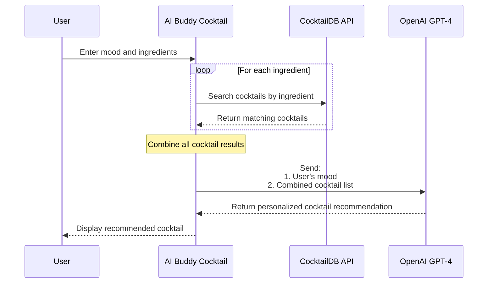

# Gen AI Workshop: AI Buddy Cocktail Recommendation 🍸

## What is this repository about?

Hey there! 👋

This is your starting point for a hands-on workshop where we'll build a fun cocktail recommendation app using AI.

We'll use OpenAI's GPT to create an AI buddy that recommends drinks based on your mood and available ingredients. Think of it as your personal AI bartender! You'll learn how to integrate AI into a real application and see the magic of generative AI in action.

## Before you start

### Required:

- A [CodeSandbox](https://codesandbox.io) account - it's where you can code without configuring anything locally
- Basic understanding of JavaScript/TypeScript
- Curiosity about AI! No prior AI experience needed

### About the OpenAI API key:

- We'll provide one during the workshop so you can jump right in
- Want to keep experimenting after? You can grab your free key at [OpenAI's platform](https://platform.openai.com/api-keys)
- Don't worry about the workshop key - we'll delete it afterward for security

## How it works

The following sequence diagram shows how our cocktail buddy interacts with different services:



## Workshop Steps

### 1. Setup (5 mins)

- Fork this [repository in CodeSandbox ](https://codesandbox.io/p/devbox/ai-buddy-cocktail-gen-j2qkgv)
- Check that everything runs correctly
- Understanding the project structure

### 2. Exploring the APIs (10 mins)

#### CocktailDB API

- Understanding the endpoints (https://www.thecocktaildb.com/api.php)
- How to search by ingredient
- Handling responses

#### OpenAI API

- API key setup (https://platform.openai.com/settings/organization/api-keys)
- Understanding chat completions
- Crafting effective prompts
    <details>
    <summary>📝 Detailed Guide: Crafting Effective Prompts</summary>

  ### System Message Design

  ```typescript
  const SYSTEM_PROMPT =
  "You are a expert bartender creating a cocktail recipe for a customer based on how they feel." +
  "your main goal is to recommend a cocktail based on a list of cocktails the user gives you. " +
  "The customer is only interested in the cocktails provided in the list." +
  "You must return a valid json with the following structure: " +
  '{"idDrink": "idDrink", "reason": "reason"}';
  ```

  ### Understanding Prompt Components

  1. **Mood Context and Available Cocktails**
     ```typescript
     const list = cocktails
       .map(
         (cocktail) =>
           ` idDrink: ${cocktail.idDrink} - nameDrink: ${cocktail.strDrink}`
       )
       .join(", ");
     const MOOD_COCKTAIL_PROMPT = `From the following list recommend a cocktail for someone who is feeling ${mood}: ${list}`;
     ```

  ### Example Implementation

  ```typescript
  // Good Prompt Structure ✅
  const createPrompt = (mood: string, cocktails: string[]) => {
    return {
      messages: [
        { role: "system", content: SYSTEM_PROMPT },
        {
          role: "user",
          content: MOOD_COCKTAIL_PROMPT,
        },
      ],
    };
  };
  ```

  ### Best Practices

  1. **Be Specific**

     - Define exact output format
     - Include clear instructions
     - Specify formatting requirements

  2. **Provide Context**

     - Include relevant user details
     - Explain constraints/preferences

  3. **Handle Edge Cases**
     ```typescript
     const safeMood = mood.toLowerCase().trim();
     const availableCocktails = cocktails.filter(
       (c) => c.ingredients.length > 0
     );
     ```

  ### Configuration

  ```typescript
  const completion = await openai.chat.completions.create({
    model: "gpt-4",
    messages: promptMessages,
    temperature: 0.7, // Balance creativity/consistency
    max_tokens: 150, // Keep responses concise
  });
  ```

    </details>

- Managing tokens and costs

### 3. Building the Cocktail Buddy (20 mins)

- Implementing ingredient search
- Combining cocktail results
- Creating the mood-based prompt
- Generating recommendations

## Project Structure
```
src/
├── api/
│   ├── cocktaildb.ts   # CocktailDB API integration
│   └── openai.ts       # OpenAI API integration
├── components/
|   └── ui/              # Shadcn-ui components
│   ├── AISettings.tsx   # Openai ui props configuration, testing purposes
│   ├── Instructions.tsx # Task main goal
│   └── Results.tsx      # Component that shows generated cocktail
|   └── UserInput.tst    # Component to handle mood and ingredients
├── types/
│   └── index.ts        # Type definitions
└── App.tsx             # Main application
```

## Best Practices

- Keep your API keys secure
- Handle API rate limits gracefully
- Implement proper error handling
- Use TypeScript for better type safety
- Test edge cases and error scenarios

## Resources

- [OpenAI API Documentation](https://platform.openai.com/docs/api-reference)
- [CocktailDB API Documentation](https://www.thecocktaildb.com/api.php)
- [TypeScript Documentation](https://www.typescriptlang.org/docs/)
- [React Documentation](https://react.dev)

Ready to build something cool? Let's get started! 🚀

## Need Help?

- Check the Issues tab for common problems
- Ask questions during the workshop

## What's Next?

After completing this workshop, you can:

- Add more features like favorite drinks
- Implement user preferences
- Add cocktail images and instructions
- Share your creations with the community

Happy coding! 🎉
